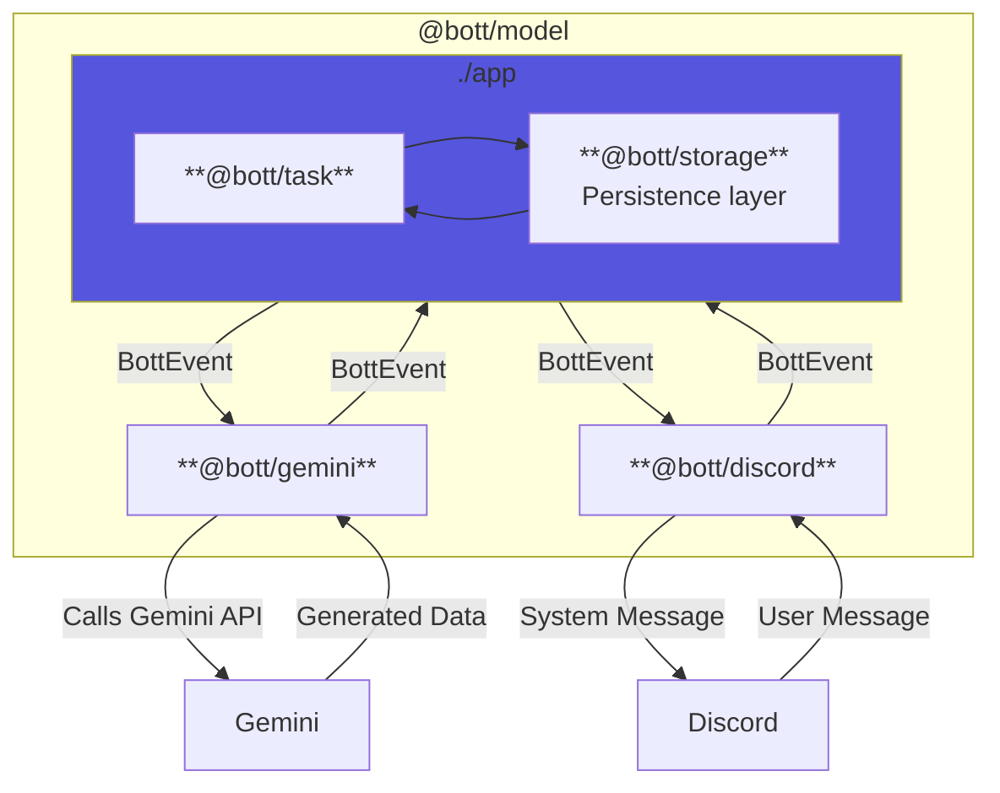

# 🤖 `@BottStaging` [IN DEVELOPMENT]


[](https://DanielLaCos.se)

A Discord bot, powered by Gemini. Currently in development: see the
[alpha release milestone](https://github.com/daniellacosse-code/Bott/milestone/2).

## Environments

| Environment | Discord Bot    | Description                                     |
| ----------- | -------------- | ----------------------------------------------- |
| Test        | `@BottTest`    | Local development with volume-mounted container |
| Staging     | `@BottStaging` | Running at DanielLaCos.se                       |
| Production  | TBA            | Public deployment (TBA)                         |

## Features

- Uses judgement on when to engage with server members, taking channel context
  into consideration.
- Views and discusses media posted in chat.
  - Supports reading JPEGs, PNGs, and most websites.
  - Experimental support for MP4s, GIFs, WAVs and MP3 files.
- Generates photos, movies, songs and essays as requested.
- Translates technical errors into user-friendly language, when appropriate.


## Development

> [!NOTE]
> Interested in contributing? See our [Contribution Guide](./CONTRIBUTING.md)!

### Getting started

#### Prerequisites

- Homebrew ([https://brew.sh/](https://brew.sh/))
- GCP Project
  ([https://developers.google.com/workspace/guides/create-project](https://developers.google.com/workspace/guides/create-project))
- Discord Application
  ([https://discord.com/developers/applications](https://discord.com/developers/applications))

#### Instructions

1. Copy `.env.example` to `.env.test`:

```sh
cp .env.example .env.test
```

3. Get your GCP information and add it to `.env.test`.
4. Get your Discord information and add it to `.env.test`.
5. Set up the environment with `deno task setup`.
6. Start the bot with `deno task app:test`.

### Configuring Bott

<details>
<summary>Bott is configured via a series of environment variables.</summary>

| Name                                | Description                                                                                                               | Default                           |
| ----------------------------------- | ------------------------------------------------------------------------------------------------------------------------- | --------------------------------- |
| `CONFIG_ASSESSMENT_MODEL`           | The AI model used for quality assessment of potential bot responses.                                                      | gemini-2.5-flash-lite             |
| `CONFIG_ASSESSMENT_SCORE_THRESHOLD` | The minimum score (1-100) a potential response must achieve in quality assessments (e.g., novelty, relevance) to be sent. | 70                                |
| `CONFIG_ERROR_MODEL`                | The AI model used for generating user-friendly error messages.                                                            | gemini-2.5-flash                  |
| `CONFIG_ESSAY_MODEL`                | The AI model used for generating essays and long-form text content.                                                       | gemini-2.5-pro                    |
| `CONFIG_EVENTS_MODEL`               | The AI model used for generating responses to chat events and user messages.                                              | gemini-2.5-flash                  |
| `CONFIG_INPUT_EVENT_LIMIT`          | The maximum number of past chat events to include in the context for the AI model.                                        | 2000                              |
| `CONFIG_INPUT_FILE_TOKEN_LIMIT`     | The maximum number of tokens to use for analyzing the content of input files (images, websites).                          | 500000                            |
| `CONFIG_MOVIE_MODEL`                | The AI model used for generating video content.                                                                           | veo-3.0-generate-preview          |
| `CONFIG_PHOTO_MODEL`                | The AI model used for generating images.                                                                                  | imagen-4.0-generate-preview-06-06 |
| `CONFIG_RATE_LIMIT_IMAGES`          | The maximum number of images Bott can generate per month.                                                                 | 100                               |
| `CONFIG_RATE_LIMIT_MUSIC`           | The maximum number of songs Bott can generate per month.                                                                  | 25                                |
| `CONFIG_RATE_LIMIT_VIDEOS`          | The maximum number of videos Bott can generate per month.                                                                 | 10                                |
| `CONFIG_SONG_MODEL`                 | The AI model used for generating music and audio content.                                                                 | lyria-002                         |
| `DISCORD_TOKEN`                     | The authentication token for your Discord bot application.                                                                | -                                 |
| `FILE_SYSTEM_ROOT`                  | The root directory on the local file system for storing input and output files.                                           | `./fs_root`                       |
| `GOOGLE_ACCESS_TOKEN`               | An access token for authenticating with Google Cloud APIs (for local development).                                        | -                                 |
| `GOOGLE_PROJECT_ID`                 | The ID of your Google Cloud project.                                                                                      | -                                 |
| `GOOGLE_PROJECT_LOCATION`           | The GCP region where your Vertex AI resources are located.                                                                | -                                 |
| `LOG_TOPICS`                        | Controls which log topics to display. Comma-separated list of topics: debug, info, warn, error, perf.                     | info,warn,error                   |
| `PORT`                              | The port of the health check server required for GCP Cloud Run.                                                           | 8080                              |

</details>

### Deploying Bott

Deploying Bott to Google Cloud Run can be done entirely from your command line
using the `gcloud` CLI.

1. **Install Google Cloud SDK**: First, ensure you have the Google Cloud SDK
   installed. (e.g. via `brew install google-cloud-sdk`)

```sh
which gcloud
```

2. **Authenticate and Set Project**: Log in to your Google Cloud account and set
   your active project.

```sh
gcloud auth login
gcloud config set project <YOUR_PROJECT_ID>
```

> [!TIP]
> If you don't have a project, you can create one with
> `gcloud projects create <YOUR_PROJECT_ID>`.

3. **Enable Required APIs**: Enable the necessary APIs for Vertex AI, Cloud
   Storage, and Cloud Run.

```sh
gcloud services enable \
  aiplatform.googleapis.com \
  storage.googleapis.com \
  run.googleapis.com \
  artifactregistry.googleapis.com \
  cloudbuild.googleapis.com
```

4. **Configure Service Account Permissions**: Find the default service account.

```sh
gcloud builds get-default-service-account
```

Then, add the `Vertex AI User` and `Storage Object Admin` roles.

```sh
gcloud projects add-iam-policy-binding <YOUR_PROJECT_ID> \
  --member="serviceAccount:<YOUR_SERVICE_ACCOUNT>" \
  --role="roles/aiplatform.user"

gcloud projects add-iam-policy-binding <YOUR_PROJECT_ID> \
  --member="serviceAccount:<YOUR_SERVICE_ACCOUNT>" \
  --role="roles/storage.objectAdmin"
```

5. **Create a `.env.production` file**: As [above](#instructions), create an
   `.env.production` file from the provided `.env.example` file and fill it out.

```sh
cp .env.example .env.production
```

6. **Deploy the Service**: Deploy the application to Cloud Run from the source
   repository. You will be prompted to set the region.

```sh
gcloud run deploy bott-service \
  --source . \
  --allow-unauthenticated \
  --region <YOUR_REGION> \
  --env-file .env.production
```

9. **Verify Deployment**: Bott should now be running correctly.

```sh
gcloud logging read "resource.type=cloud_run_revision AND resource.labels.service_name=bott-service" --limit 50
```

### High-level Architecture

> [!TIP]
> Review the code data model annotated in [./model/types.ts](./model/types.ts).



---

## Licensing

This project is **dual-licensed**. This model allows for free, open-source use
for non-commercial purposes while requiring a separate license for commercial
applications.

- **For Non-Commercial Use:** This software is free and open-source under the
  terms of the **GNU Affero General Public License v3.0 (AGPLv3)**.
  - Read the full AGPLv3 license details in the [LICENSE file](./LICENSE).

- **For Commercial Use:** Use of this software for any purpose that is intended
  for commercial advantage or monetary compensation requires a **Proprietary
  Commercial License**. Please contact [D@nielLaCos.se](mailto:d@niellacos.se)
  to discuss licensing terms.

**Copyright (C) 2025 DanielLaCos.se**
