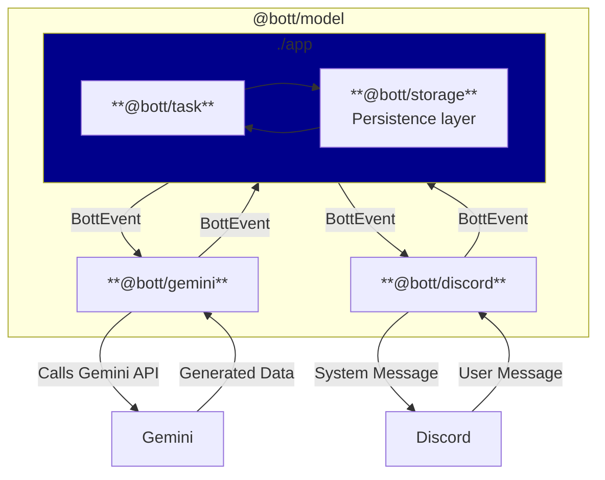

# 🤖 `@Bott`


[](https://DanielLaCos.se)

A Discord bot, powered by Gemini.

## Features

- Uses judgement on when to engage with server members, taking channel context into
  consideration.
- Views and discusses media posted in chat.
  - Supports reading JPEGs, PNGs, and most websites.
  - Experimental support for MP4s, GIFs, WAVs and MP3 files.
- Generates photos, movies, songs and essays as requested.
- Translates technical errors into user-friendly language, when appropriate.

## Development

> [!NOTE]
> Interested in contributing? See our [Contribution Guide](./CONTRIBUTING.md)!

### Getting started

#### Prerequisites

- Homebrew ([https://brew.sh/](https://brew.sh/))
- GCP Project
  ([https://developers.google.com/workspace/guides/create-project](https://developers.google.com/workspace/guides/create-project))
- Discord Application
  ([https://discord.com/developers/applications](https://discord.com/developers/applications))

#### Instructions

1. Copy `.env.example` to `.env.development`:

```sh
cp .env.example .env.development
```

3. Get your GCP information and add it to `.env.development`.
4. Get your Discord information and add it to `.env.development`.
5. Set up the environment with `deno task setup`.
6. Start Bott with `deno task start:dev`.

### Configuring Bott

Bott is configured via a series of environment variables.

| Name                                | Description                                                                                                               | Default     |
| ----------------------------------- | ------------------------------------------------------------------------------------------------------------------------- | ----------- |
| `CONFIG_ASSESSMENT_SCORE_THRESHOLD` | The minimum score (1-100) a potential response must achieve in quality assessments (e.g., novelty, relevance) to be sent. | 70          |
| `CONFIG_INPUT_EVENT_LIMIT`          | The maximum number of past chat events to include in the context for the AI model.                                        | 2000        |
| `CONFIG_INPUT_FILE_TOKEN_LIMIT`     | The maximum number of tokens to use for analyzing the content of input files (images, websites).                          | 500000      |
| `CONFIG_RATE_LIMIT_IMAGES`          | The maximum number of images Bott can generate per month.                                                                 | 100         |
| `CONFIG_RATE_LIMIT_MUSIC`           | The maximum number of songs Bott can generate per month.                                                                  | 25          |
| `CONFIG_RATE_LIMIT_VIDEOS`          | The maximum number of videos Bott can generate per month.                                                                 | 10          |
| `DISCORD_TOKEN`                     | The authentication token for your Discord bot application.                                                                | -           |
| `FILE_SYSTEM_ROOT`                  | The root directory on the local file system for storing input and output files.                                           | `./fs_root` |
| `GOOGLE_ACCESS_TOKEN`               | An access token for authenticating with Google Cloud APIs (for local development).                                        | -           |
| `GOOGLE_PROJECT_ID`                 | The ID of your Google Cloud project. (Automatically set during Cloud Run deployment.)                                     | -           |
| `GOOGLE_PROJECT_LOCATION`           | The GCP region where your Vertex AI resources are located. (Automatically set during Cloud Run deployment.)               | -           |
| `PORT`                              | The port of the health check server required for GCP Cloud Run.                                                           | 8080        |

### Deploying Bott

Deploying Bott to Google Cloud Run involves two main steps: deploying the
service itself, then configuring the necessary permissions.

#### 1. Deploy the Service

Click this button to deploy the Bott service:

[](https://deploy.cloud.run?git_repo=https://github.com/daniellacosse-code/Bott.git)

#### 2. Configure Permissions _(TODO: confirm this)_

1. Navigate to the
   **[IAM & Admin](https://console.cloud.google.com/iam-admin/iam)** page in
   your Google Cloud project.
2. Find the service account that was created for your new Cloud Run service.
3. Click the **pencil icon** to edit its permissions.
4. Click **+ ADD ANOTHER ROLE** and add the following two roles:
   - `Vertex AI User` (allows the bot to access Gemini models)
   - `Storage Object Admin` (allows the bot to read/write temporary files)
5. Click **SAVE**.

Bott should now be running correctly. You may need to trigger a new revision
deployment from the Cloud Run console for the permission changes to take effect
immediately.

### High-level Architecture

> [!TIP]
> Review the code data model annotated in [./model/types.ts](./model/types.ts).



---

## Licensing

This project is **dual-licensed**. This model allows for free, open-source use
for non-commercial purposes while requiring a separate license for commercial
applications.

- **For Non-Commercial Use:** This software is free and open-source under the
  terms of the **GNU Affero General Public License v3.0 (AGPLv3)**.
  - Read the full AGPLv3 license details in the [LICENSE file](./LICENSE).

- **For Commercial Use:** Use of this software for any purpose that is intended
  for commercial advantage or monetary compensation requires a **Proprietary
  Commercial License**. Please contact [D@nielLaCos.se](mailto:d@niellacos.se)
  to discuss licensing terms.

**Copyright (C) 2025 DanielLaCos.se**
