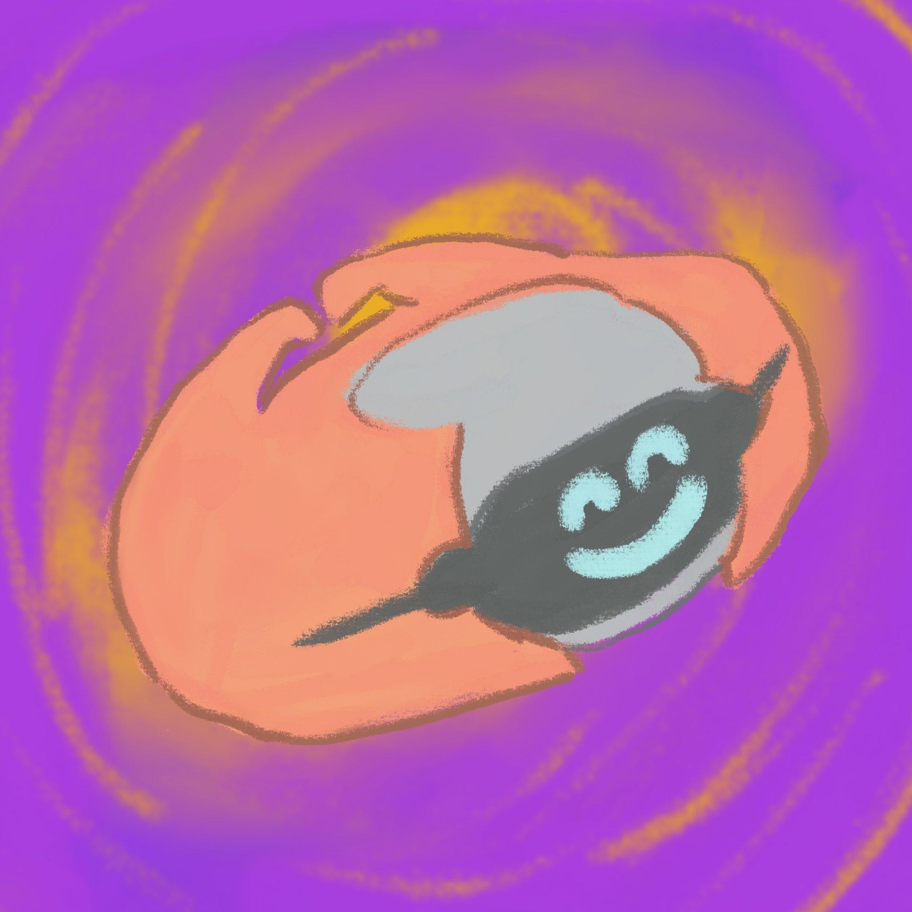
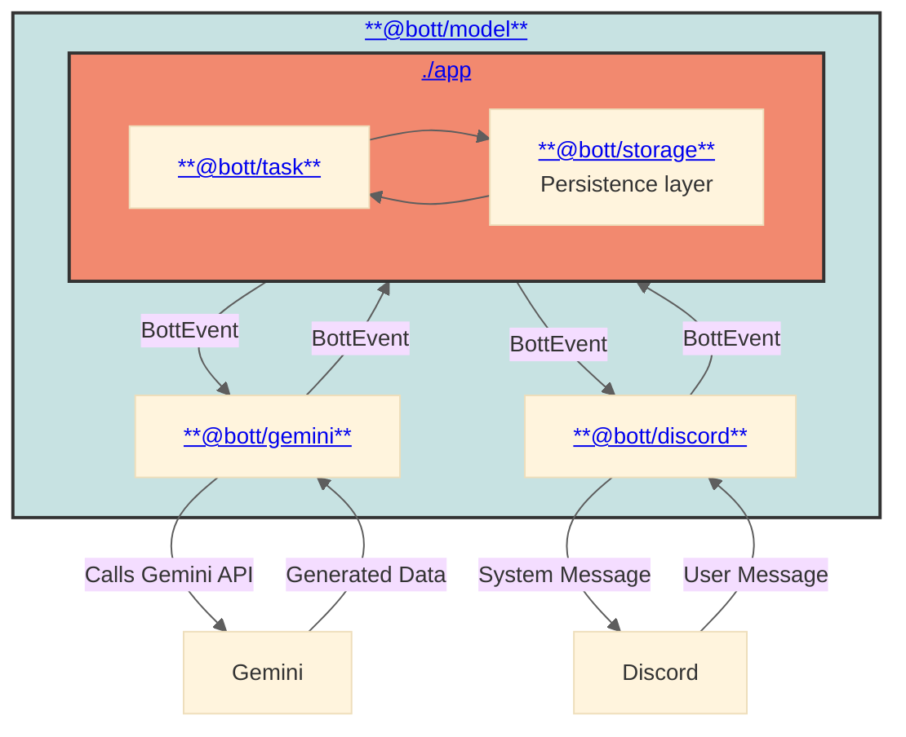

# `@Bott`

An autonomous groupchat agent.

> [!CAUTION]
>
> 🛑  🛑
>
> **Currently in development:** see the
> [alpha release milestone](https://github.com/daniellacosse-code/Bott/milestone/2).
> Use at your own risk.

## Current Features

- Bott uses a pre-configured
  [`Identity`](./app/settings/identity.md.ejs) and
  [`Reasons`](./app/settings/reasons.ts) to determine when to
  engage with server members.
- They view and can discuss most types of media posted in chat. _(See:
  [Supported Attachment Types](./model/types/events.ts))_
- They asynchronously perform tasks as requested:
  - Generates photos, movies, songs and essays as requested.
  - _(TBD)_

### Supported Integrations

#### Chat Clients

- [Discord](./libraries/discord)

#### AI Models

- [Gemini](./libraries/gemini)

## High-level Architecture

> [!TIP]
> Click on the links in the diagram below to navigate to a specific component's
> documentation.

### Configuration

Bott is configured via a series of environment variables. For a full list,
descriptions, and default values, please refer to the
[constants.ts](./constants.ts) file.

### Event Generation

Bott processes incoming messages and events through a complicated multi-step
process to avoid undue chatter. For a more detailed breakdown of this process
_(currently implemented via Gemini - see:
**[Gemini Event Pipeline documentation](./libraries/gemini/events)**)_.

## Contributing

**Interested in contributing?** See our [Contribution Guide](./CONTRIBUTING.md)!

## Gallery

<table>
  <tr>
    <td>
      <figure>
        
         
        <figcaption><i>Bott's origin</i></figcaption>
      </figure>
    </td>
    <td>
      <figure>
        
         
        <figcaption><i>Concept art by <a href="https://DanielLaCos.se">DanielLaCos.se</a></i></figcaption>
      </figure>
    </td>
  </tr>
</table>

## Licensing

This project is **dual-licensed**. This model allows for free, open-source use
for non-commercial purposes while requiring a separate license for commercial
applications.

- **For Non-Commercial Use:** This software is free and open-source under the
  terms of the **GNU Affero General Public License v3.0 (AGPLv3)**.
  - Read the full AGPLv3 license details in the [LICENSE file](./LICENSE).

- **For Commercial Use:** Use of this software for any purpose that is intended
  for commercial advantage or monetary compensation requires a **Proprietary
  Commercial License**. Please contact [D@nielLaCos.se](mailto:d@niellacos.se)
  to discuss licensing terms.

**Copyright (C) 2025 DanielLaCos.se**
