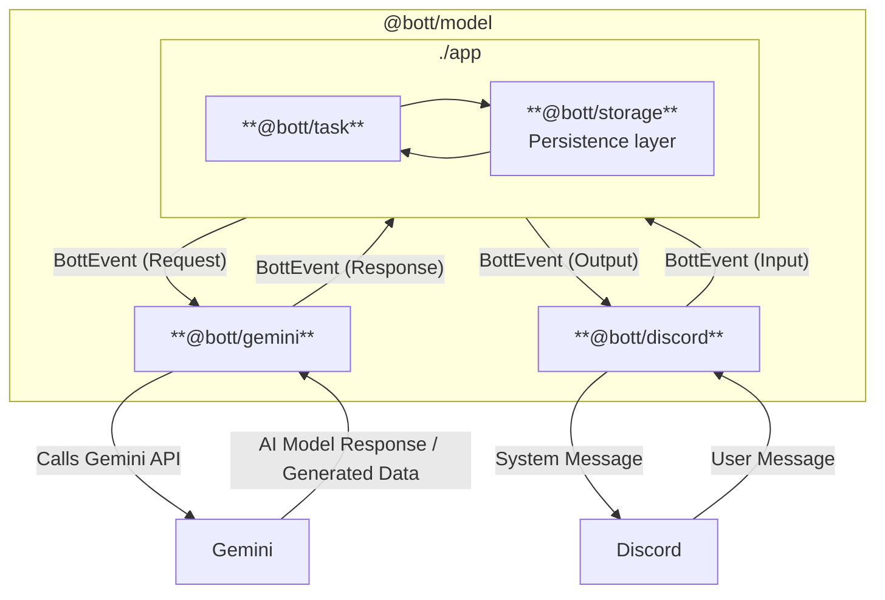

# 🤖 `@Bott`


[](https://DanielLaCos.se)

A Discord bot, powered by Gemini.

## Features

- Engages with server members when appropriate.
- Generates images, videos and audio when requested.
- ???

## Development

> [!NOTE]
> Interested in contributing? See our [Contribution Guide](./CONTRIBUTING.md)!

### Getting started

#### Prerequisites

- GCP Project (TODO)
- Discord developer account (TODO)
- Homebrew (TODO)

#### Instructions

1. Copy `.env.example` to `.env.development`:

```sh
cp .env.example .env.development
```
3. Get your GCP information and add it to `.env.development`.
4. Get your Discord information and add it to `.env.development`.
5. Set up the environment with `deno task setup`.
6. Start Bott with `deno task start:dev`.

### Configuring Bott

Bott is configured via a series of environment variables. _(...)_
<!-- TODO: ticket for hydrating rate limiter -->

Name                                | Description    | Default
--                                  | --             | --
`CONFIG_ASSESSMENT_SCORE_THRESHOLD` | TODO           | 70
`CONFIG_INPUT_EVENT_LIMIT`          | TODO           | 2000
`CONFIG_INPUT_FILE_TOKEN_LIMIT`     | TODO           | 500000
`CONFIG_RATE_LIMIT_IMAGES`          | TODO           | 100
`CONFIG_RATE_LIMIT_MUSIC`           | TODO           | 25
`CONFIG_RATE_LIMIT_VIDEOS`          | TODO           | 10
`DISCORD_TOKEN`                     | TODO           | -
`FILE_SYSTEM_ROOT`                  | TODO           | `./fs_root`
`GOOGLE_ACCESS_TOKEN`               | TODO           | -
`GOOGLE_PROJECT_ID`                 | TODO           | -
`GOOGLE_PROJECT_LOCATION`           | TODO           | -
`PORT`                              | TODO           | 8080


### Deploying Bott

Due to the nature of the Vertex AI API, Bott supports only GCP.

_TODO: make sure this works_

[](https://deploy.cloud.run?git_repo=https://github.com/daniellacosse-code/Bott.git)

### Architecture

> [!TIP]
> Review the code data model annotated in [./model/types.ts](./model/types.ts).



---

## Licensing

This project is **dual-licensed** (pending legal review):

- **For Non-Commercial Use:** This software is free and open-source under the
  terms of the **GNU Affero General Public License v3.0 (AGPLv3)**.
  - Read the full AGPLv3 license details in the [LICENSE file](./LICENSE).

- **For Commercial Use:** If you intend to use this software for commercial
  purposes (any use directly or indirectly intended for commercial advantage or
  monetary compensation), you are required to obtain a **Proprietary Commercial
  License**. Contact me at [D@nielLaCos.se](mailto:d@niellacosse.se) for
  commercial licensing inquiries.

**Copyright (C) 2025 DanielLaCos.se**
