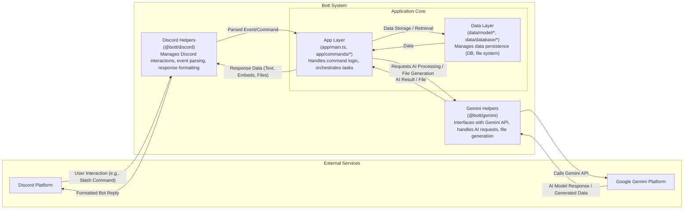

# `@Bott`

A Discord Bot, powered by Gemini.


## Getting started

Duplicate `.env.example` to `app/.env.development` and fill it out.

Then run:

```sh
brew bundle
gcloud auth login
deno task start:app
```

## Deploy

[](https://deploy.cloud.run?git_repo=https://github.com/daniellacosse-code/Bott.git)

Duplicate `.env.example` to `.env.production` and fill it out.

```sh
deno task deploy
```

You can also run the Dockerfile locally with `deno task start`.

## Architecture


