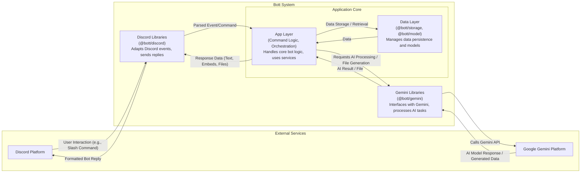

# 🤖 `@Bott`


A Discord Bot, powered by Gemini.

## Getting started (WIP)

Duplicate `.env.example` to `.env.development` and fill it out.

Then run:

```sh
brew bundle
gcloud auth login
deno task start:app
```

[](https://deploy.cloud.run?git_repo=https://github.com/daniellacosse-code/Bott.git)

## Architecture (WIP)

Review the code data model annotated in [./model/types.ts](./model/types.ts).

_(Diagram not yet entirely accurate: all modules code up to the @bott/model)_



---

## Licensing

This project is **dual-licensed** (pending legal review):

- **For Non-Commercial Use:** This software is free and open-source under the
  terms of the **GNU Affero General Public License v3.0 (AGPLv3)**.
  - Read the full AGPLv3 license details in the [LICENSE file](./LICENSE).

- **For Commercial Use:** If you intend to use this software for commercial
  purposes (any use directly or indirectly intended for commercial advantage or
  monetary compensation), you are required to obtain a **Proprietary Commercial
  License**. Contact me at [D@nielLaCos.se](mailto:d@niellacosse.se) for
  commercial licensing inquiries.

**Copyright (C) 2025 DanielLaCos.se**
