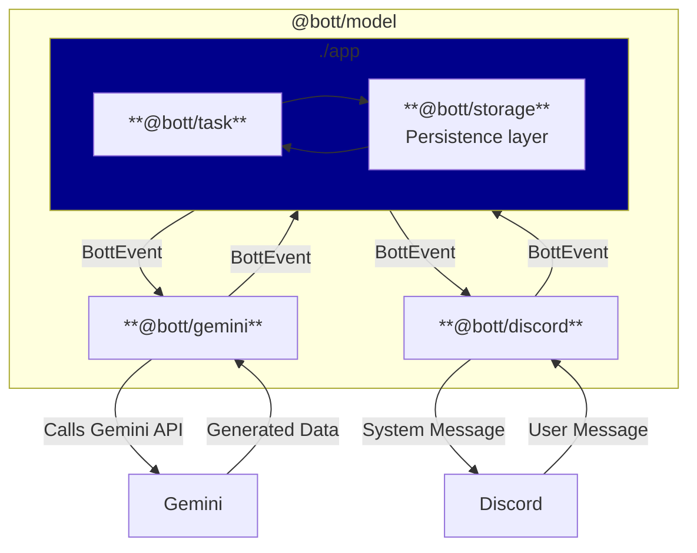

# 🤖 `@Bott`


[](https://DanielLaCos.se)

A Discord bot, powered by Gemini.

## Features

- Uses judgement on when to engage with server members, taking channel context
  into consideration.
- Views and discusses media posted in chat.
  - Supports reading JPEGs, PNGs, and most websites.
  - Experimental support for MP4s, GIFs, WAVs and MP3 files.
- Generates photos, movies, songs and essays as requested.
- Translates technical errors into user-friendly language, when appropriate.

## Development

> [!NOTE]
> Interested in contributing? See our [Contribution Guide](./CONTRIBUTING.md)!

### Getting started

#### Prerequisites

- Homebrew ([https://brew.sh/](https://brew.sh/))
- GCP Project
  ([https://developers.google.com/workspace/guides/create-project](https://developers.google.com/workspace/guides/create-project))
- Discord Application
  ([https://discord.com/developers/applications](https://discord.com/developers/applications))

#### Instructions

1. Copy `.env.example` to `.env.development`:

```sh
cp .env.example .env.development
```

3. Get your GCP information and add it to `.env.development`.
4. Get your Discord information and add it to `.env.development`.
5. Set up the environment with `deno task setup`.
6. Start Bott with `deno task start:dev`.

### Configuring Bott

Bott is configured via a series of environment variables.

| Name                                | Description                                                                                                               | Default                           |
| ----------------------------------- | ------------------------------------------------------------------------------------------------------------------------- | --------------------------------- |
| `CONFIG_ASSESSMENT_MODEL`           | The AI model used for quality assessment of potential bot responses.                                                      | gemini-2.5-flash-lite             |
| `CONFIG_ASSESSMENT_SCORE_THRESHOLD` | The minimum score (1-100) a potential response must achieve in quality assessments (e.g., novelty, relevance) to be sent. | 70                                |
| `CONFIG_ERROR_MODEL`                | The AI model used for generating user-friendly error messages.                                                            | gemini-2.5-flash                  |
| `CONFIG_ESSAY_MODEL`                | The AI model used for generating essays and long-form text content.                                                       | gemini-2.5-pro                    |
| `CONFIG_EVENTS_MODEL`               | The AI model used for generating responses to chat events and user messages.                                              | gemini-2.5-flash                  |
| `CONFIG_INPUT_EVENT_LIMIT`          | The maximum number of past chat events to include in the context for the AI model.                                        | 2000                              |
| `CONFIG_INPUT_FILE_TOKEN_LIMIT`     | The maximum number of tokens to use for analyzing the content of input files (images, websites).                          | 500000                            |
| `CONFIG_MOVIE_MODEL`                | The AI model used for generating video content.                                                                           | veo-3.0-generate-preview          |
| `CONFIG_PHOTO_MODEL`                | The AI model used for generating images.                                                                                  | imagen-4.0-generate-preview-06-06 |
| `CONFIG_RATE_LIMIT_IMAGES`          | The maximum number of images Bott can generate per month.                                                                 | 100                               |
| `CONFIG_RATE_LIMIT_MUSIC`           | The maximum number of songs Bott can generate per month.                                                                  | 25                                |
| `CONFIG_RATE_LIMIT_VIDEOS`          | The maximum number of videos Bott can generate per month.                                                                 | 10                                |
| `CONFIG_SONG_MODEL`                 | The AI model used for generating music and audio content.                                                                 | lyria-002                         |
| `DISCORD_TOKEN`                     | The authentication token for your Discord bot application.                                                                | -                                 |
| `FILE_SYSTEM_ROOT`                  | The root directory on the local file system for storing input and output files.                                           | `./fs_root`                       |
| `GOOGLE_ACCESS_TOKEN`               | An access token for authenticating with Google Cloud APIs (for local development).                                        | -                                 |
| `GOOGLE_PROJECT_ID`                 | The ID of your Google Cloud project.                                                                                      | -                                 |
| `GOOGLE_PROJECT_LOCATION`           | The GCP region where your Vertex AI resources are located.                                                                | -                                 |
| `LOG_TOPICS`                        | Controls which log topics to display. Comma-separated list of topics: debug, info, warn, error, perf.                     | info,warn,error                   |
| `PORT`                              | The port of the health check server required for GCP Cloud Run.                                                           | 8080                              |

### Deploying Bott [PENDING TEST]

Deploying Bott to Google Cloud Run involves three main steps: setting up your
GCP project, deploying the service, and configuring the necessary permissions.

#### 1. Set Up Your Google Cloud Project

Before deploying, you need to create a GCP project and enable the required APIs:

1. **Create a Google Cloud Project**:
   - Go to the [Google Cloud Console](https://console.cloud.google.com/)
   - Click "Select a project" → "New Project"
   - Choose a project name and note the **Project ID** (you'll need this later)
   - Click "Create"

2. **Enable Required APIs**: Navigate to the
   [APIs & Services](https://console.cloud.google.com/apis/dashboard) page and
   enable:
   - **Vertex AI API** - Required for Gemini AI models
   - **Cloud Storage API** - Required for temporary file storage
   - **Cloud Run API** - Required for deployment

   You can enable these APIs by searching for them in the API Library or using
   these direct links:
   - [Enable Vertex AI API](https://console.cloud.google.com/flows/enableapi?apiid=aiplatform.googleapis.com)
   - [Enable Cloud Storage API](https://console.cloud.google.com/flows/enableapi?apiid=storage-api.googleapis.com)
   - [Enable Cloud Run API](https://console.cloud.google.com/flows/enableapi?apiid=run.googleapis.com)

3. **Choose a Region**:
   - Select a region for your Vertex AI resources (e.g., `us-central1`,
     `us-east4`, `europe-west4`)
   - Note this region as you'll need it for the `GOOGLE_PROJECT_LOCATION`
     environment variable

#### 2. Deploy the Service

Click this button to deploy the Bott service:

[](https://deploy.cloud.run?git_repo=https://github.com/daniellacosse-code/Bott.git)

During deployment, you'll be prompted to configure the environment variables:

**Required Variables:**

- `DISCORD_TOKEN` - Your Discord bot token from the
  [Discord Developer Portal](https://discord.com/developers/applications)
- `GOOGLE_PROJECT_ID` - Your GCP Project ID from step 1
- `GOOGLE_PROJECT_LOCATION` - Your chosen region (e.g., `us-central1`)

**Optional Variables (with sensible defaults):**

- All `CONFIG_*` variables are optional and have reasonable defaults
- You can customize AI models, rate limits, and other settings as needed
- See the [configuration table](#configuring-bott) above for all available
  options

#### 3. Configure Permissions

After deployment, configure the service account permissions:

1. Navigate to the
   **[IAM & Admin](https://console.cloud.google.com/iam-admin/iam)** page in
   your Google Cloud project.
2. Find the service account that was created for your new Cloud Run service (it
   will have a name like `PROJECT-ID@PROJECT-ID.iam.gserviceaccount.com`).
3. Click the **pencil icon** to edit its permissions.
4. Click **+ ADD ANOTHER ROLE** and add the following roles:
   - `Vertex AI User` - Allows the bot to access Gemini models
   - `Storage Object Admin` - Allows the bot to read/write temporary files
5. Click **SAVE**.

#### 4. Verify Deployment

1. Go to the [Cloud Run console](https://console.cloud.google.com/run) to see
   your deployed service
2. Click on the service name to view details
3. Check the "Logs" tab to ensure the service started successfully
4. The service should show as "Receiving traffic" with a green checkmark

Bott should now be running correctly. You may need to trigger a new revision
deployment from the Cloud Run console for the permission changes to take effect
immediately.

### High-level Architecture

> [!TIP]
> Review the code data model annotated in [./model/types.ts](./model/types.ts).



---

## Licensing

This project is **dual-licensed**. This model allows for free, open-source use
for non-commercial purposes while requiring a separate license for commercial
applications.

- **For Non-Commercial Use:** This software is free and open-source under the
  terms of the **GNU Affero General Public License v3.0 (AGPLv3)**.
  - Read the full AGPLv3 license details in the [LICENSE file](./LICENSE).

- **For Commercial Use:** Use of this software for any purpose that is intended
  for commercial advantage or monetary compensation requires a **Proprietary
  Commercial License**. Please contact [D@nielLaCos.se](mailto:d@niellacos.se)
  to discuss licensing terms.

**Copyright (C) 2025 DanielLaCos.se**
