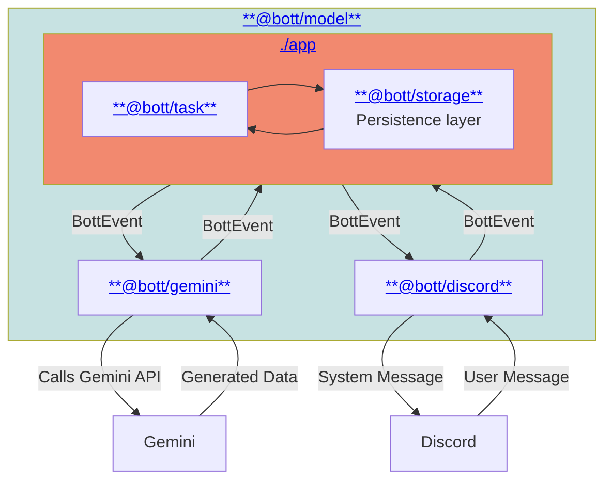

#  `@Bott`

An autonomous groupchat agent.

---

> [!CAUTION]
>
> 🛑  🛑
>
> **Currently in development:** see the
> [alpha release milestone](https://github.com/daniellacosse-code/Bott/milestone/2).
> Use at your own risk.

## Current Features

- Uses its pre-configured `Identity` and `Reasons` to determine when to engage
  with server members.
- Views and discusses most types of media posted in chat. (See
  [Media Support](#media-support))
- Asynchronously performs tasks as requested:
  - Generates photos, movies, songs and essays as requested.
  - _(TBD)_

### Supported Integrations

#### Chat Clients

- [Discord](./libraries/discord)

#### AI Models

- [Gemini](./libraries/gemini)

## Development

> [!NOTE]
> Interested in contributing? See our [Contribution Guide](./CONTRIBUTING.md)
> for contribution guidelines and the development guide!

### High-level Architecture

> [!TIP]
> Click on the components in the diagram below to navigate to their
> documentation.

#### Event Generation

Bott processes incoming messages and events through complicated multi-step to
avoid undue chatter. For a more detailed breakdown of this process (currently
implemented via Gemini), see the
**[Gemini Event Pipeline documentation](./libraries/gemini/events/README.md)**.

## Gallery

<figure>
  
  <figcaption>Bott's origin</figcaption>
</figure>

<figure>
  
  <figcaption>concept art by DanielLaCos.se</figcaption>
</figure>

## Licensing

This project is **dual-licensed**. This model allows for free, open-source use
for non-commercial purposes while requiring a separate license for commercial
applications.

- **For Non-Commercial Use:** This software is free and open-source under the
  terms of the **GNU Affero General Public License v3.0 (AGPLv3)**.
  - Read the full AGPLv3 license details in the [LICENSE file](./LICENSE).

- **For Commercial Use:** Use of this software for any purpose that is intended
  for commercial advantage or monetary compensation requires a **Proprietary
  Commercial License**. Please contact [D@nielLaCos.se](mailto:d@niellacos.se)
  to discuss licensing terms.

**Copyright (C) 2025 DanielLaCos.se**
