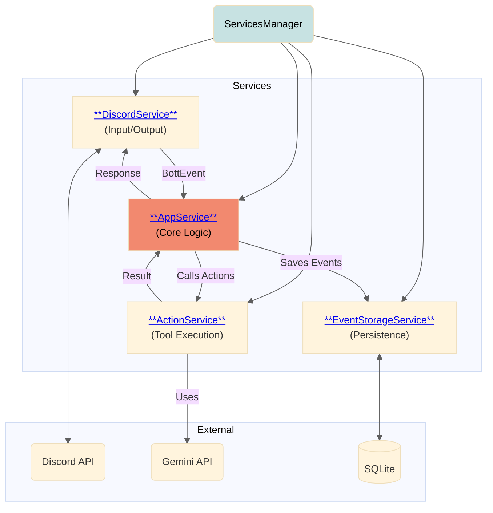

# Bott Architecture

> [!TIP]
> Click on the links in the diagram below to navigate to a specific component's
> documentation.

> [!WARNING]
> The following diagram is somewhat outdated and will be updated soon. Bott has
> migrated to more of a pseudo-services architecture.

## Configuration

Bott is configured via a series of environment variables. For a full list,
descriptions, and default values, please refer to the
[constants.ts](./constants.ts) file.

## Event Generation

Bott processes incoming messages and events through a complicated multi-step
process to avoid undue chatter.

For a more detailed breakdown of this process _(currently implemented via
Gemini - see:
**[Gemini Event Pipeline documentation](./libraries/aiModels/gemini/events)**)_.
