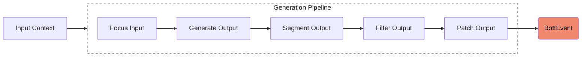

# Gemini Event Pipeline

This directory contains the logic for generating `BottEvent`s using Google's
Gemini models. The core of this functionality is exposed via the
[`generateEvents`](./generate.ts) function.

## Input Curation

Before invoking the AI model, the `generateEvents` function curates the input
history to ensure it fits within the model's context window and cost
constraints.

- **Time Limit**: Events older than `INPUT_EVENT_TIME_LIMIT_MS` are discarded.
- **Token Limit**: Recent events are prioritized. File attachments (images,
  audio, video) are included only if they fit within the
  `INPUT_FILE_TOKEN_LIMIT`.
- **File Counts**: Limits are enforced on the number of audio and video files to
  prevent overloading the model.

This curation process ensures that the model receives the most relevant and
recent context while respecting resource quotas.

## Pipeline Architecture

The generation process is structured as a linear pipeline of **5 distinct
steps**. Each step receives the current `EventPipelineContext` and returns an
updated context.

### 1. Focus Input ([`01_focusInput`](./pipeline/01_focusInput))

This step analyzes the curated input events to determine what the bot should
focus on. It may use a lightweight model or heuristics to:

- Identify which users or topics are most relevant.
- Select specific messages to "reply" to.

### 2. Generate Output ([`02_generateOutput`](./pipeline/02_generateOutput))

The core generation step. It constructs the prompt for the Gemini model,
including:

- System instructions.
- The curated event history.
- The "Focus" determined in step 1.

It then calls the Gemini API and parses the raw response into candidate
`BottEvent` structures.

### 3. Segment Output ([`03_segmentOutput`](./pipeline/03_segmentOutput))

Raw AI responses can be long and monolithic. This step breaks them down into
smaller, more conversational segments (e.g., separate messages for a thought
followed by a reply).

### 4. Filter Output ([`04_filterOutput`](./pipeline/04_filterOutput))

Each candidate output event is evaluated for quality.

- **Assessment**: A separate "Evaluator" model (or a lightweight check) scores
  the response (e.g., for relevance, safety, personality).
- **Threshold**: Responses scoring below `CONFIG_ASSESSMENT_SCORE_THRESHOLD` are
  discarded.

### 5. Patch Output ([`05_patchOutput`](./pipeline/05_patchOutput))

The final polish. This step reviews the set of surviving output events to ensure
coherence. It might:

- Fill in semantic gaps.
- Ensure that if a question was asked, it is answered.
- Format the final output for Discord (e.g., truncating long messages).
